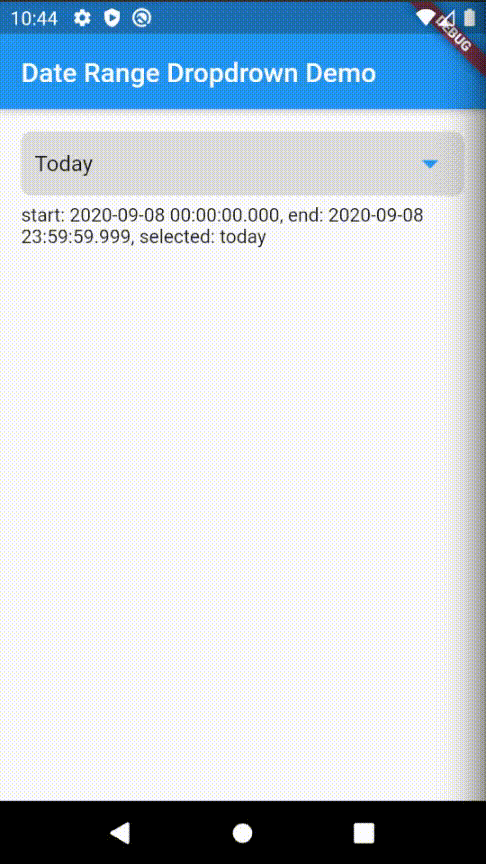

# Date Range Dropdown
[](https://pub.dev/packages/date_range_dropdown)


Set predefined date ranges with dropdown.

## Demo


## Getting Started

### Installation

Add to `pubspec.yaml` in `dependencies`

```
date_range_dropdown: ^1.0.2
```

### Usage

```
import 'package:date_range_dropdown/date_range_dropdown.dart';

List<DatePickerModel> dates = List<DatePickerModel>();

dates.add(DatePickerModel.fromJson({
    "id": 'today',
    "title": "Today",
    "startDate": Jiffy().startOf(Units.DAY),
    "endDate": Jiffy().endOf(Units.DAY)
}));

dates.add(DatePickerModel.fromJson({
    "id": "custom",
    "title": "Custom",
    "startDate": DateTime.now(),
    "endDate": DateTime.now()
}));

DateRangeDropdown(
    dates: dates,
    onChanged: (DatePickerModel value) => setState(
        () {
        _selected = value.id;
        _startDate = value.startDate;
        _endDate = value.endDate;
        },
    ),
    callback: (DateTimeRange picked) => setState(
        () {
        _startDate = picked.start;
        _endDate = picked.end;
        },
    ),
)
```

### Theme Customization

```
import 'package:date_range_dropdown/date_range_dropdown.dart';

List<DatePickerModel> dates = List<DatePickerModel>();

dates.add(DatePickerModel.fromJson({
    "id": 'today',
    "title": "Today",
    "startDate": Jiffy().startOf(Units.DAY),
    "endDate": Jiffy().endOf(Units.DAY)
}));

dates.add(DatePickerModel.fromJson({
    "id": "custom",
    "title": "Custom",
    "startDate": DateTime.now(),
    "endDate": DateTime.now()
}));

DateRangeDropdown(
    dates: dates,
     theme: (BuildContext context, Widget child) {
        return Theme(
        data: ThemeData(
            buttonTheme:
                ButtonThemeData(textTheme: ButtonTextTheme.accent),
            accentColor: Colors.red,
            primaryColor: Colors.red,
        ),
        child: child,
        );
    },
    dropdownIconColor: Colors.red,
    onChanged: (DatePickerModel value) => setState(
        () {
        _selected = value.id;
        _startDate = value.startDate;
        _endDate = value.endDate;
        },
    ),
    callback: (DateTimeRange picked) => setState(
        () {
        _startDate = picked.start;
        _endDate = picked.end;
        },
    ),
)
```


## Example app

Please checkout [example](https://github.com/wendellrocha/date_range_dropdown/tree/master/example).